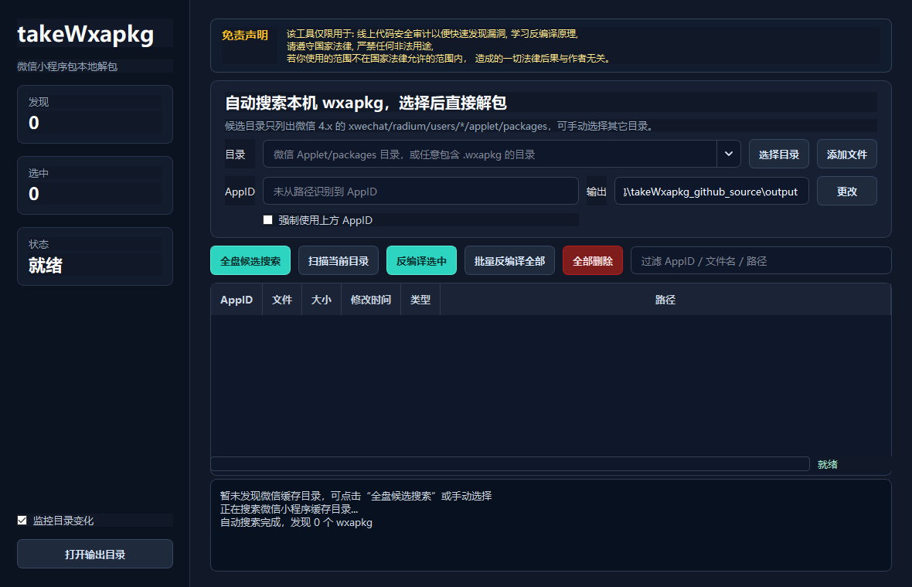

# takeWxapkg


`takeWxapkg` 是一个 Windows 桌面版微信小程序 `.wxapkg` 本地解包与反编译辅助工具。

它面向安全审计、代码学习和本地包结构分析场景，支持自动搜索微信 4.x 小程序缓存目录，选择主包/分包后直接解包，并生成可查看的源码目录、zip 包和分析报告。

## 界面预览



## 支持功能

- [x] 支持微信小程序 `.wxapkg` 包扫描
- [x] 支持微信 4.x `xwechat/radium/users/*/applet/packages` 自动发现
- [x] 支持手动选择目录或单个 `.wxapkg` 文件
- [x] 支持普通包解包
- [x] 支持 `V1MMWX` 加密包解密
- [x] 支持按 AppID 和版本自动聚合主包、分包
- [x] 支持分包代码和插件包文件整理
- [x] 支持 JS / JSON / WXML / WXSS / WXS / 图片 / wasm / worker 等文件输出
- [x] 支持常见微信开发者工具导入错误修复
- [x] 支持源码 zip 一键生成
- [x] 支持反编译报告输出
- [x] 支持目录内 `.wxapkg` 包批量删除
- [x] 支持 PyInstaller onefile exe 打包

## 免责声明

该工具仅限用于: 线上代码安全审计以便快速发现漏洞, 学习反编译原理,
请遵守国家法律, 严禁任何非法用途,
若你使用的范围不在国家法律允许的范围内， 造成的一切法律后果与作者无关。

## 打包版下载

Windows 打包版可通过网盘下载:

[https://pan.quark.cn/s/d366d1adeb28](https://pan.quark.cn/s/d366d1adeb28)

## 方式一: 使用源码运行

准备环境:

- Windows 10/11
- Python 3.11+

安装依赖并启动:

```powershell
git clone https://github.com/<your-name>/takeWxapkg.git
cd takeWxapkg

python -m venv .venv
.\.venv\Scripts\python.exe -m pip install --upgrade pip
.\.venv\Scripts\python.exe -m pip install -r requirements.txt
.\.venv\Scripts\python.exe main.py
```

## 命令行使用

项目也保留了基础命令行入口，适合快速处理单个包或脚本化调用。

```powershell
.\.venv\Scripts\python.exe -m takewxapkg.cli app.wxapkg -a wx0000000000000000 -o output/manual
```

参数说明:

| 参数 | 作用 |
| --- | --- |
| `wxapkg` | 一个或多个 `.wxapkg` 文件路径 |
| `-a, --appid` | 加密包 AppID |
| `-o, --output` | 输出目录，默认 `output/manual` |

## 打包 EXE

```powershell
.\.venv\Scripts\python.exe -m PyInstaller --clean --noconfirm takeWxapkg.spec
```

打包完成后生成:

```text
dist/takeWxapkg.exe
```

当前配置使用 PyInstaller onefile，打包后不会在 exe 同级目录生成 `_internal`。

## 小程序包目录结构

微信 4.x 常见缓存目录类似:

```text
Tencent/
└─ xwechat/
   └─ radium/
      └─ users/
         └─ <user-id>/
            └─ applet/
               └─ packages/
                  └─ wx0000000000000000/
                     └─ 123/
                        ├─ __APP__.wxapkg
                        ├─ pages_subpkg.wxapkg
                        └─ plugin.wxapkg
```

takeWxapkg 会优先按同一个 AppID、同一个版本目录聚合主包和分包，避免只解一个包导致页面文件缺失。

## 输出目录结构

```text
output/
└─ wx0000000000000000_v123/
   ├─ decompiled/
   │  ├─ app.json
   │  ├─ pages/
   │  ├─ components/
   │  ├─ app.js
   │  └─ app.wxss
   ├─ reports/
   │  └─ takeWxapkg-report.json
   └─ takeWxapkg-src.zip
```

## 项目结构

```text
takeWxapkg/
├─ assets/                  UI 静态资源
├─ docs/images/             README 截图
├─ licenses/                第三方许可证文本
├─ takewxapkg/              主程序源码
│  ├─ gui.py                PySide6 桌面界面
│  ├─ path_finder.py        微信缓存目录发现和 wxapkg 扫描
│  ├─ wxapkg_core.py        解密、解包、后处理和报告生成
│  └─ cli.py                命令行入口
├─ tests/                   单元测试
├─ vendor/                  本地可选运行时说明
├─ main.py                  GUI 入口
├─ takeWxapkg.spec          PyInstaller 配置
└─ requirements.txt         Python 依赖
```

## 测试

```powershell
.\.venv\Scripts\python.exe -m unittest discover -s tests -v
```

## QA

**Q: 为什么导入微信开发者工具时提示页面文件不存在?**

A: 通常是只解了主包，没有把同版本分包一起处理。takeWxapkg 会自动补齐同版本主包/分包，手动处理时也建议把同一个版本目录下的 `.wxapkg` 一起选择。

**Q: 为什么有些文件是空占位?**

A: 小程序包本身可能缺少某些分包、插件或公共资源。为了让目录结构更完整，程序会尽量用真实文件匹配；无法还原时会生成最小可解析占位，避免微信开发者工具直接报缺文件。

**Q: 加密包 AppID 不对怎么办?**

A: 默认会从微信缓存目录路径中识别 AppID。只有识别错误时才需要勾选“强制使用上方 AppID”并手动填写。

## 第三方声明

如果你发布的 exe 或压缩包包含第三方运行时，请同步提供 `THIRD_PARTY_NOTICES.md` 和对应许可证文本，并遵守相关开源许可证要求。

## 贡献

欢迎提交 issue 和 pull request。建议提交前先运行测试，确认不会破坏基础解包、目录扫描和打包逻辑。
